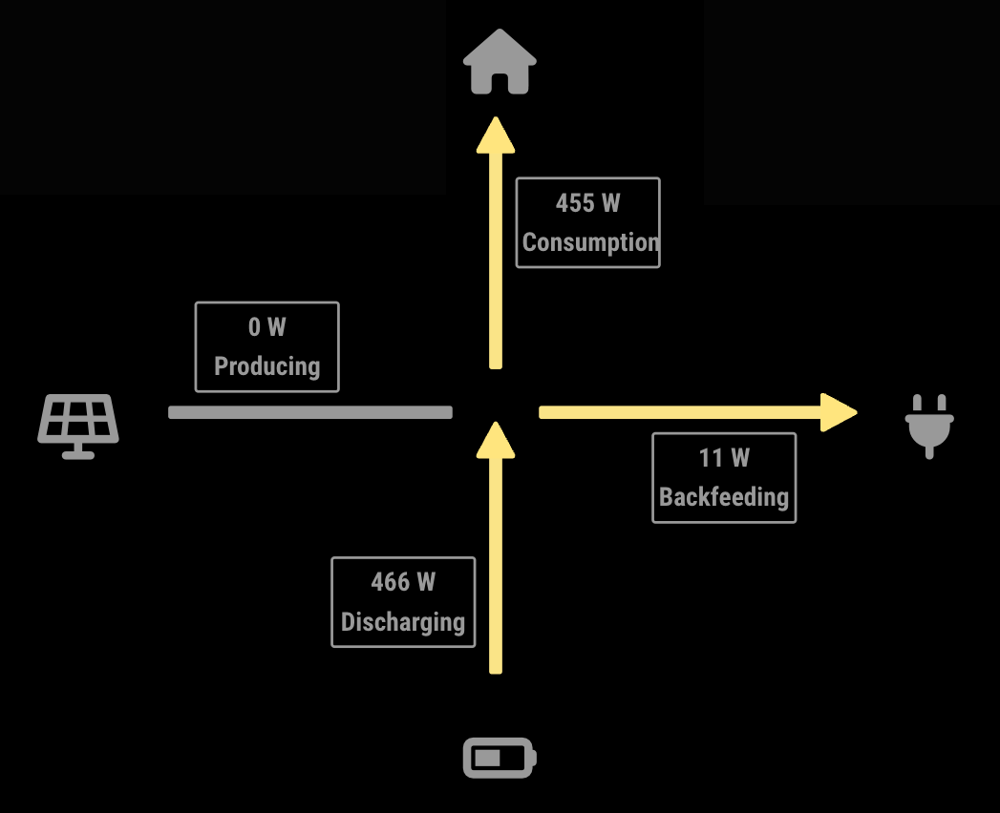

# MMM-EnergyMonitor

This is a module for the [MagicMirror²](https://github.com/MichMich/MagicMirror/).

This module visualizes current energy production and consumption of your home. It is meant to be used when you have a solar system (and an optional battery) installed in your home.

## About

The module has the following features:

* Show live data of power production and consumption of your home
* The module is developed to be used in *center regions* of the MagicMirror. If you want to use it somewhere else, please feel free to submit a Pull Request.
* This module was developed as a companion to [MMM-Fronius2](https://github.com/deg0nz/MMM-Fronius2) and [MMM-VartaESS](https://github.com/deg0nz/MMM-VartaESS) to visualize their data. But other data sources are supported as well.

**Attention: This module depends on external data sources. It cannot be used as standalone module. Please refer to the "Data Sources" section below!**

## Installing

This module has no external dependencies (apart from the data sources mentiones above). Just clone it:

``` bash
cd modules
git clone https://github.com/deg0nz/MMM-EnergyMonitor.git
```

## Status

The current development status of this module is: **maintained**

This means: I'm open for feature requests, pull requests, bug reports, ...

## Screenshots



## Using the module

To use this module, add the following configuration block to the modules array in the `config/config.js` file:

```js
var config = {
    modules: [
        {
            module: 'MMM-EnergyMonitor',
            position: 'middle_center'
        }
    ]
}
```

## Configuration options

*Note: You should test various combinations of `width`, `height` and `lineWidth` that work for your mirror resolution. All the other values are calculated and should scale automatically*

Please refer to [MMM-EnergyMonitor default configuration](MMM-EnergyMonitor.js) to prevent syntax errors.

| Option           | Description
|----------------- |-----------
| `energyStorage`  | *Optional* Configure if you have Energy Storage System installed in your home and it should be displayed by the module<br><br>**Type:** `boolean` (yes/no) <br>Default: `true` (yes - ESS installed)
| `height`         | *Optional* The height of the module<br><br>**Type:** CSS size value <br>Default: `600px` (600 Pixel)
| `width`          | *Optional* The width of the module<br><br>**Type:** CSS size value <br>Default: `700px` (700 Pixel)
| `lineWidth`      | *Optional* Thickness of the lines pointing to the center<br><br>**Type:** CSS size value <br>Default: `10px` (10 Pixel)
| `updateInterval` | *Optional* How often should the UI be updated<br><br>**Type:** `int` (milliseconds) <br>Default: `3000` milliseconds (3 seconds)
| `wattConversionOptions` | *Optional* Configures if and how Watts should ge converted to kW<br><br>**Type:** `object` <br>See configuration below
| `wattConversionOptions`.`enabled` | *Optional* Turns the feature on/off<br><br>**Type:** `boolean` (on/off)<br>Default: `true` (on)
| `wattConversionOptions`.`threshold` | *Optional* At which value should numbers be converted <br><br>**Type:** `int` (Watt) <br>Default: `1200` Watt
| `wattConversionOptions`.`numDecimalDigits` | *Optional* To how many decimal digits should the converted value be shortened (keep this value low to prevent UI glitches) <br><br>**Type:** `int` <br>Default: `2` (example: 1.45 kW)
| `logNotifications` | *Optional* If the module should log the data notifications/updates it receives. This value is good for debugging if the module shows weird values.<br><br>**Type:** `boolean` (on/off)<br>Default: `false` off

## Data Sources

Per default, my companion modules [MMM-Fronius2](https://github.com/deg0nz/MMM-Fronius2) and [MMM-VartaESS](https://github.com/deg0nz/MMM-VartaESS) are able to send data to this module. You can use other modules as data sources for this module.

All the values are expected to be from the point of view of the corresponding system. Negative values are interpreted as *pulling energy from* the system. Positive values are interpreted as *pushing energy into* the system.

Other modules can send the following notifications to update data for this module:

| Notification                                    | Unit | What is updated | Interpretation
|-------------------------------------------------|------| ----------------|--------------------------------------------------
| `MMM-EnergyMonitor_ENERGY_STORAGE_POWER_UPDATE` | Watt | Energy Storage  | **Negative** values ar interpreted as **drawing** power **from the energy storage**.<br>**Positive** values are interpreted as **charging the energy storage**. 
| `MMM-EnergyMonitor_GRID_POWER_UPDATE`           | Watt | Grid Power      | **Negative** values ar interpreted as *drawing* power *from the grid*.<br>**Positive** values are interpreted as **feeding** back **into the grid**. 
| `MMM-EnergyMonitor_SOLAR_POWER_UPDATE`          | Watt | Solar Power     | The currently produced solar powwer. This value must always be 0 or positive.

## Special Thanks

* [MichMich](https://github.com/MichMich) for creating the Magic Mirror Project
* [hukl](http://smyck.net) for creating the [SMYCK color theme](http://color.smyck.org) on which the default colors are based

## Issues

If you find any problems, bugs or have questions, please open a [GitHub issue](https://github.com/deg0nz/MMM-EnergyMonitor/issues) in this repository.

## Disclaimer

All product and company names are trademarks™ or registered® trademarks of their respective holders. Use of them does not imply any affiliation with or endorsement by them. 
